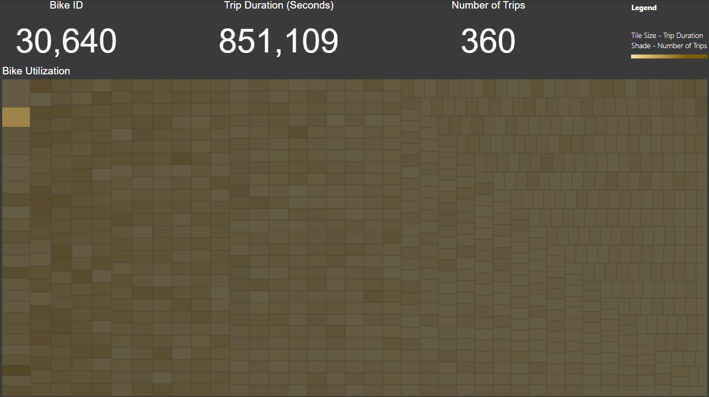

# Ride-Share Analysis

## Overview of Project

Kate is looking to start a bike share program in her hometown of Des Moines, Iowa after having a great experience with one during a vacation to New York City. Kate has a potential seed investor, and has requested my help to discover and display information about how the bike sharing program works in New York City, and how that will translate to Des Moines. I will be exploring, analyzing, and displaying the Citibike ride-share data from August 2019.

## Resources
- Data Source: 201908-citibike-tripdata.csv
- Software: Microsoft Power BI Desktop 2.102

## Analysis Results

### Power BI Canvas #1

In the first report, we can observe a live count of the number of bikes used, number of trips taken, and the average trip duration in August 2019. There are graphs to display the peak usage hours as well as a break down of usage based on customer type, gender, and age. One outlier to note is the birth year of 1969 does not follow the trend shown in the area chart, and could possibly be due to customers entering false information for their date of birth and 1969 seems to be the most popular for some reason. 

The report is also dynamic, and can be filtered by starting station, start time, customer type, gender, and birth year. These filters can help narrow the differences between the city of New York and Des Moines, and what can be expected in the new demographic.

### Power BI Canvas #2

The second report takes a deeper look at the most popular starting and stopping locations, and visually plots them onto a map. Each circle represents a station’s geographical position with the frequency of rides from that location being represented by increased size and darkness. One thing of note should be that some stopping locations are shown in New Jersey, as some people must be using Citibike to travel across state. It also drills down on the most popular start times by filtering them for each day of the week, and having the table colourized for ease of understanding with the more popular times represented in a darker colour. A similar table is displayed for the most popular stop times. The last chart shows the average trip duration based on the time of day, and gender. Two things to note are that customers, or subscribers who did not specify gender, tend to take longer trips when using the bikes even though we saw from the previous report that they use them less frequently. And the all-around average trip duration tends to be higher during non peak hours, and especially overnight.

### Power BI Canvas #3

The final canvas shows us a treemap of each bike’s utilization. This breaks down which bikes have been used for the longest trip durations as represented by the block size, with the largest box in the top left corner and the smallest on the bottom right corner. Each box is also coloured with the darker boxes representing the bikes with the greatest number of uses. This report can be used to keep track of which bike is most likely to be in need of maintenance. 

## Summary

The analytical break down, and display of this data should help Kate with her presentation to her potential investor. Additional information that would be beneficial to her would be to compare the demographic difference between New York and Iowa, and how focusing on the most successful aspects of the business in New York will translate to guaranteed success in Iowa.