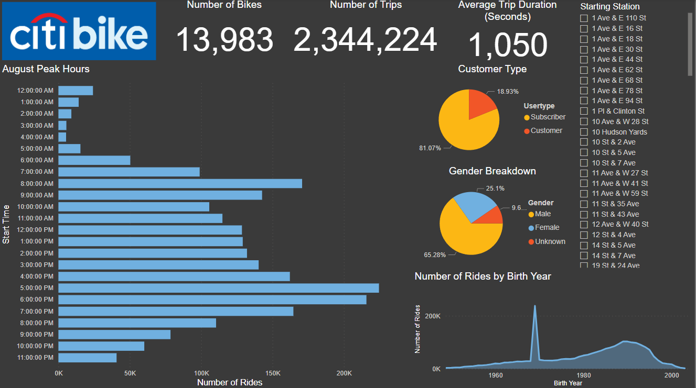
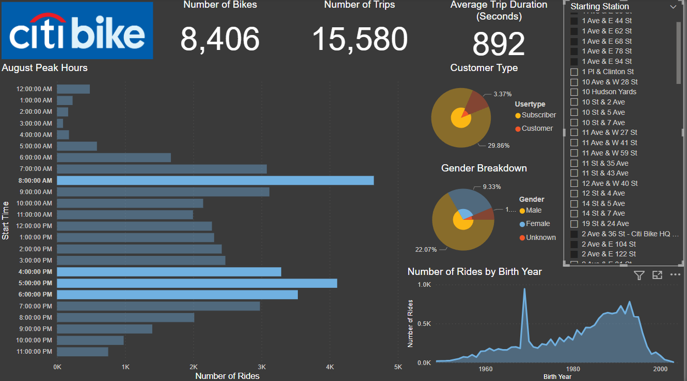
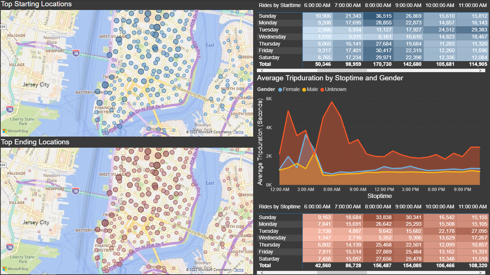

# Ride-Share Analysis

## Overview of Project

Kate is looking to start a bike share program in her hometown of Des Moines, Iowa after having a great experience with one during a vacation to New York City. Kate has a potential seed investor, and has requested my help to discover and display information about how the bike sharing program works in New York City, and how that will translate to Des Moines. I will be exploring, analyzing, and displaying the Citibike ride-share data from August 2019.

## Resources
- Data Source: 201908-citibike-tripdata.csv
- Software: Microsoft Power BI Desktop 2.102

## Analysis Results

### Power BI Canvas #1

In the first report, we can observe a live count of the number of bikes used, number of trips taken, and the average trip duration in August 2019. There are graphs to display the peak usage hours as well as a break down of usage based on customer type, gender, and age. One outlier to note is the birth year of 1969 does not follow the trend shown in the area chart, and could possibly be due to customers entering false information for their date of birth and 1969 seems to be the most popular for some reason. 

The report is also dynamic, and can be filtered by starting station, start time, customer type, gender, and birth year. These filters can help narrow the differences between the city of New York and Des Moines, and what can be expected in the new demographic.

## Summary